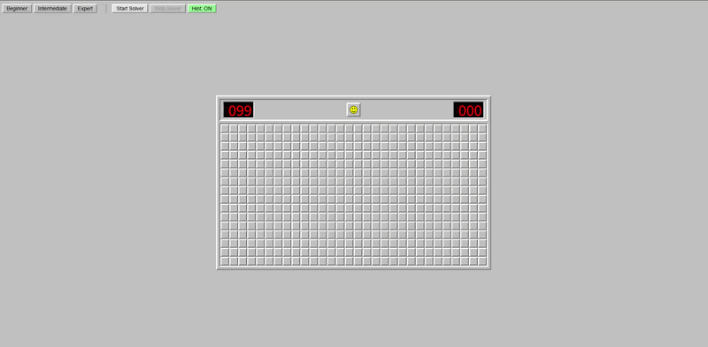
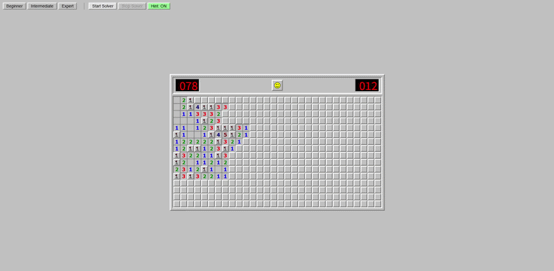

# Minesweeper Lab 🧨🤖

<details open>
<summary><strong>한국어</strong></summary>

로컬에서 실행되는 **지뢰찾기 웹 페이지**와, 이를 자동으로 플레이하는 **솔버 엔진**입니다.  
기존의 Python 외부 솔버(`mine-local.py`)뿐만 아니라, 이제 **웹 브라우저 내부에 직접 통합된 강력한 솔버**를 통해 게임을 즐길 수 있습니다.

## 🚀 주요 업데이트 및 추가 기능

### 1) 브라우저 내장 솔버 (In-Browser Solver)
이제 별도의 Python 실행 없이 웹 화면의 버튼만으로 솔버를 구동할 수 있습니다.
- **Start Solver**: 게임을 자동으로 시작하고 끝까지 플레이합니다.
- **Stop Solver**: 자동 플레이를 즉시 중단합니다.



### 2) 실시간 힌트 시스템 (Live Hint & Probability)
마우스 오버만으로 각 칸의 안전 확률을 실시간으로 계산하여 보여줍니다.
- **Hint 버튼**: 힌트 모드를 켜고 끌 수 있습니다.
- **안전 확률 표시**: 논리적으로 확정된 칸은 `100.0% Safe` 또는 `0.0% Safe`로 표시하며, 불확실한 칸은 수학적 확률을 계산하여 보여줍니다.



### 3) 사용자 편의 기능
- **Space 키 재시작**: 게임 중 언제든 스페이스바를 눌렀다 떼면 새로운 게임이 시작됩니다 (스마일 아이콘 클릭과 동일).
- **시각적 피드백**: 숫자 칸을 꾹 누르고 있으면 주변 칸들이 함께 눌리는 효과를 주어 클래식 지뢰찾기의 조작감을 재현했습니다.

---

## 🛠️ 실행 방법 (Setup)

### 1) 브라우저 내장 솔버 (추천)
**별도의 설치가 필요 없습니다.**  
`minesweeper.html` 파일을 크롬(Chrome)이나 에지(Edge) 등 최신 브라우저로 열기만 하면 모든 기능을 즉시 사용할 수 있습니다.

### 2) 외부 파이썬 솔버 (Advanced)
`mine-local.py`를 통해 브라우저를 외부에서 제어하고 싶다면 아래 환경 설정이 필요합니다.

**아나콘다(Conda) 환경 셋업:**
```bash
conda create -n minesweeper-bot python=3.10 -y
conda activate minesweeper-bot

pip install playwright
playwright install
```

**실행:**
```bash
python mine-local.py
```

---

## 구성
- `minesweeper.html` — 브라우저 내장 솔버 및 힌트 기능이 포함된 지뢰찾기 웹 페이지
- `mine-local.py` — Playwright 기반 외부 자동 솔버/봇 (레거시 지원)
- `hint.mp4`, `start-stop solver.mp4` — 기능 시연 영상

## 솔버 엔진 상세 (In-Game Engine)

### 1) 확정적 추론 (Deterministic)
- 단순 숫자 비교뿐만 아니라 **부분집합(Subset) 분석**을 통해 1-2-1, 1-2-2-1 등 복잡한 패턴을 해결합니다.

### 2) 모순 검증 (Contradiction Check / Lookahead)
- "만약 이 칸이 지뢰라면?"이라는 가설을 세워 논리적 모순이 발생하는지 체크하는 강력한 알고리즘을 사용합니다. 이를 통해 아주 먼 칸의 정보로 현재 칸을 확정하는 고난도 추론이 가능합니다.

### 3) 확률적 추측 (Guessing)
- 확정 가능한 칸이 없을 경우, 프론티어에서 가장 안전한(지뢰 확률이 낮은) 칸을 자동으로 선택합니다.

## 조작 방법 및 주의사항

- **난이도 선택**: 상단 메뉴의 Beginner, Intermediate, Expert 버튼을 사용하세요.
- **게임 재시작**: 웃는 얼굴 아이콘을 클릭하거나 **Space** 키를 사용하세요.
- **자동 플레이**: `Start Solver`를 누르세요. (힌트 모드를 켜면 솔버가 자동으로 중단됩니다.)
- **주의**: 이 솔버는 로컬 `minesweeper.html`을 위해 설계되었습니다. 외부 사이트에서 사용 시 자동화 감지로 차단될 수 있으니 주의하세요.

## Contribution 🤝
- 더 정교한 확률 계산 알고리즘
- 새로운 시각적 테마 및 UI 개선
- 통계 데이터 수집 및 분석 기능

모든 기여를 환영합니다. PR 및 Issue 자유롭게 남겨주세요.

</details>

---

<details>
<summary><strong>English</strong></summary>

A local **Minesweeper web implementation** with an **integrated solver engine**.  
In addition to the external Python solver (`mine-local.py`), you can now use the **powerful built-in solver** directly within the browser.

## 🚀 Key Updates & Features

### 1) In-Browser Solver
Run the solver with simple button clicks on the web page.
- **Start Solver**: Automatically starts and plays the game to completion.
- **Stop Solver**: Immediately halts the automated play.


### 2) Live Hint System (Safety Probability)
Calculate and display the safety probability of each cell on hover.
- **Hint Button**: Toggle hint mode on/off.
- **Safety Probability**: Displays `100.0% Safe` or `0.0% Safe` for deterministic cells, and mathematical probability for uncertain ones.


### 3) Quality of Life Improvements
- **Space Key Restart**: Press and release the Space key to restart the game at any time (same as clicking the smiley).
- **Visual Feedback**: Holding down a number cell simulates the "pressed" state for neighbors, mimicking the classic Minesweeper feel.

---

## 🛠️ Setup & Usage

### 1) In-Browser Solver (Recommended)
**No installation required.**  
Simply open `minesweeper.html` in any modern browser (Chrome, Edge, etc.) to use all features immediately.

### 2) External Python Solver (Advanced)
If you wish to control the browser externally via `mine-local.py`, you need to set up the environment:

**Conda Environment Setup:**
```bash
conda create -n minesweeper-bot python=3.10 -y
conda activate minesweeper-bot

pip install playwright
playwright install
```

**Run:**
```bash
python mine-local.py
```

---

## Project Structure
- `minesweeper.html` — Minesweeper with built-in solver and hint features
- `mine-local.py` — Playwright-based external solver (legacy support)
- `hint.mp4`, `start-stop solver.mp4` — Feature demonstration videos

## Solver Engine Details

### 1) Deterministic Reasoning
- Uses **Subset Analysis** to solve complex patterns like 1-2-1 and 1-2-2-1.

### 2) Contradiction Check (Lookahead)
- Employs a powerful "What if?" algorithm to check for logical contradictions, enabling high-level inference based on distant cell information.

### 3) Probabilistic Guessing
- If no deterministic moves remain, the solver automatically selects the cell with the lowest mine probability.

## Controls & Notes

- **Difficulty**: Choose Beginner, Intermediate, or Expert from the top menu.
- **Restart**: Click the smiley or press the **Space** key.
- **Auto-play**: Click `Start Solver`. (Hint mode will automatically stop the solver.)
- **Warning**: This solver is designed for the local `minesweeper.html`. Use on external sites at your own risk.

## Contribution 🤝
Contributions such as improved probability algorithms, UI themes, or statistical analysis tools are welcome. Feel free to open issues or submit pull requests.

</details>
